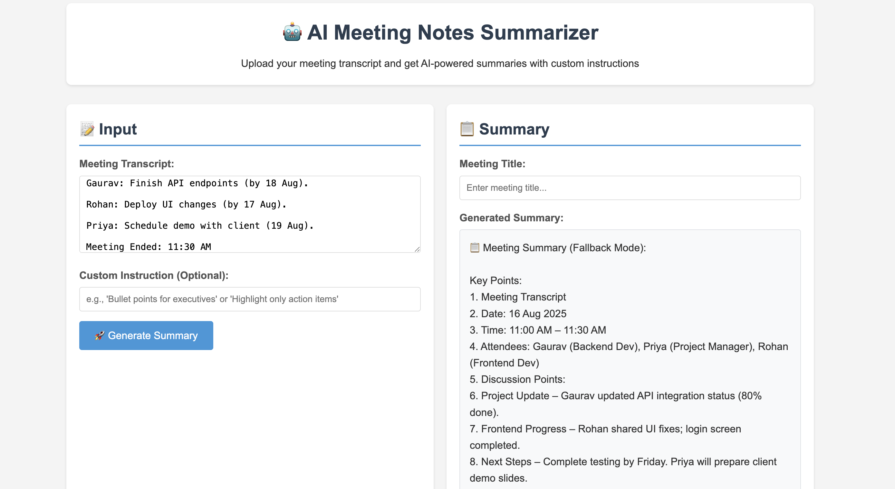
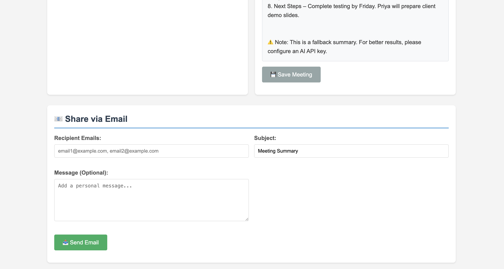

# AI Meeting Notes Summarizer

A full-stack Django application that uses AI to generate structured summaries from meeting transcripts with custom instructions.

## Features

- 📝 **Transcript Upload**: Paste or type meeting transcripts
- 🤖 **AI-Powered Summaries**: Multiple AI providers with fallback options
  - **OpenAI GPT**: High-quality summaries (requires credits)
  - **Groq**: Fast summaries with free tier (100 requests/day)
  - **Fallback Mode**: Always-free rule-based summaries
- ⚙️ **Custom Instructions**: Specify how you want the summary formatted (e.g., "bullet points for executives", "highlight action items")
- ✏️ **Editable Summaries**: Edit generated summaries before saving
- 💾 **Save & Store**: Save meetings with titles and summaries
- 📧 **Email Sharing**: Share summaries via email (simulated)
- 🎨 **Simple UI**: Clean, responsive interface focused on functionality
- 🆓 **Free Options**: Multiple ways to use without payment

## Technology Stack

- **Backend**: Python, Django, Django REST Framework
- **Frontend**: HTML, CSS, JavaScript (vanilla)
- **AI Service**: OpenAI GPT-3.5-turbo
- **Database**: SQLite (can be changed to PostgreSQL/MySQL in production)

## Prerequisites

- Python 3.8 or higher
- **Optional**: AI API keys for enhanced functionality
  - OpenAI API key (for GPT models)
  - Groq API key (for free tier access)
- **No API key required** for basic functionality (fallback mode)

## Installation & Setup

### 1. Clone the repository
```bash
git clone <repository-url>
cd assignment
```

### 2. Create a virtual environment
```bash
python -m venv venv
source venv/bin/activate  # On Windows: venv\Scripts\activate
```

### 3. Install dependencies
```bash
pip install -r requirements.txt
```

**Note**: The application uses specific compatible versions of `requests` and `openai` to avoid dependency conflicts. If you encounter issues, ensure you have the exact versions specified in `requirements.txt`.

### 4. Set up environment variables
Create a `.env` file in the root directory:
```bash
cp env_example.txt .env
```

Edit `.env` and add your preferred AI API keys:
```
# OpenAI API Key (optional - for GPT models)
OPENAI_API_KEY=your_actual_openai_api_key_here

# Groq API Key (optional - free tier available)
GROQ_API_KEY=your_groq_api_key_here
```

**Note**: You can leave these empty to use the free fallback mode!

### 5. Run database migrations
```bash
python manage.py makemigrations
python manage.py migrate
```

### 6. Create a superuser (optional)
```bash
python manage.py createsuperuser
```

### 7. Run the development server
```bash
python manage.py runserver
```

The application will be available at `http://127.0.0.1:8000/`

## 🖼️ Application Screenshots

### Main Interface (s1.png)

*The main application interface showing:*
- **Left Panel**: Input section with meeting transcript textarea and custom instructions
- **Right Panel**: Summary section with meeting title input and generated summary display
- **Sample Transcript**: Pre-loaded example meeting data for testing
- **Generate Summary Button**: Blue button to trigger AI processing

### Summary Generation & Email Sharing (s2.png)

*Generated summary with email sharing functionality showing:*
- **Generated Summary**: AI-processed meeting summary in fallback mode
- **Save Meeting Button**: Grey button to save the current summary
- **Email Sharing Form**: Complete email interface with recipient, subject, and message fields
- **Fallback Notice**: Yellow warning box explaining the summary was generated using free fallback mode

## Usage

### 1. Generate Summary
- Navigate to the main page
- Paste your meeting transcript in the left panel
- (Optional) Add custom instructions for the summary format
- Click "Generate Summary"

### 2. Edit & Save
- Review the generated summary
- Make any necessary edits directly in the summary area
- Add a meeting title
- Click "Save Meeting"

### 3. Share via Email
- After saving, the email sharing section will appear
- Enter recipient email addresses (comma-separated)
- Customize subject and message
- Click "Send Email"

## API Endpoints

- `POST /api/generate-summary/` - Generate AI summary from transcript
- `POST /api/save-meeting/` - Save or update meeting
- `POST /api/share-email/` - Share summary via email
- `GET /api/meeting/<id>/` - Get meeting details

## 🆓 Free AI Alternatives

The application supports multiple AI providers with **free options** available:

### 1. **Groq (Recommended - Free Tier)**
- **Cost**: $0 (100 free requests per day)
- **Speed**: Very fast (faster than OpenAI)
- **Quality**: Excellent for summarization
- **Setup**: Get free API key from [https://console.groq.com/](https://console.groq.com/)

### 2. **Fallback Mode (Always Free)**
- **Cost**: $0 (no API key required)
- **Features**: Automatic text processing and summarization
- **Quality**: Good for basic meeting summaries
- **Availability**: Works immediately without setup

### 3. **OpenAI (Paid Service)**
- **Cost**: Pay-per-use (requires credits)
- **Quality**: Highest quality AI summaries
- **Setup**: Requires API key and account credits

## Customization

### AI Provider Selection
The application automatically tries providers in this order:
1. **Groq** (if API key provided)
2. **OpenAI** (if API key provided and credits available)
3. **Fallback Mode** (always works, completely free)

### AI Model Configuration
You can modify the AI models in `summarizer/views.py`:

```python
# For Groq
response = client.chat.completions.create(
    model="llama3-8b-8192",  # Fast and free
    # ... other parameters
)

# For OpenAI
response = client.chat.completions.create(
    model="gpt-3.5-turbo",  # Change to GPT-4 or other models
    # ... other parameters
)
```

### Summary Prompts
Customize the AI prompt in `summarizer/views.py` to get different types of summaries.

### Email Integration
Currently, email sharing is simulated. To implement real email sending, modify the `share_via_email` view in `summarizer/views.py` using Django's email functionality or services like SendGrid.

## Project Structure

```
assignment/
├── meeting_summarizer/          # Main Django project
│   ├── __init__.py
│   ├── settings.py             # Project settings
│   ├── urls.py                 # Main URL configuration
│   ├── wsgi.py                 # WSGI configuration
│   └── asgi.py                 # ASGI configuration
├── summarizer/                  # Main app
│   ├── __init__.py
│   ├── admin.py                # Admin interface
│   ├── apps.py                 # App configuration
│   ├── models.py               # Database models
│   ├── serializers.py          # DRF serializers
│   ├── views.py                # View functions
│   └── urls.py                 # App URL patterns
├── templates/                   # HTML templates
│   └── summarizer/
│       └── index.html          # Main page
├── static/                      # Static files
│   └── css/
│       └── style.css           # Additional styles
├── manage.py                    # Django management script
├── requirements.txt             # Python dependencies
├── env_example.txt             # Environment variables template
├── s1.png                      # Main interface screenshot
├── s2.png                      # Summary and email sharing screenshot
└── README.md                   # This file
```

## 🚀 Quick Start (No API Key Required!)

**Want to try the application immediately without any setup?**

1. **Clone and install:**
   ```bash
   git clone <repository-url>
   cd assignment
   python -m venv venv
   source venv/bin/activate  # On Windows: venv\Scripts\activate
   pip install -r requirements.txt
   ```

2. **Start the application:**
   ```bash
   python manage.py migrate
   python manage.py runserver
   ```

3. **Use immediately:**
   - Open `http://127.0.0.1:8000/`
   - Paste any meeting transcript
   - Click "Generate Summary"
   - **Get free summaries instantly!** 🎉

**No API keys, no registration, no payment required!**

### 🎯 **What You'll See:**
- **s1.png**: Clean interface with input/output panels
- **s2.png**: Generated summaries and email sharing
- **Fallback Mode**: Automatic text processing without AI costs
- **Sample Data**: Pre-loaded meeting transcript for testing

## Troubleshooting

### Common Issues

1. **No API Key Error**: The application works without API keys using fallback mode
2. **OpenAI API Error**: Ensure your API key is correct and has sufficient credits
3. **OpenAI Version Error**: The application uses OpenAI API v1.0.0+. If you get version errors, ensure you have `openai>=1.0.0` installed
4. **OpenAI Client Error**: If you get "unexpected keyword argument 'proxies'" error, ensure you have compatible versions: `requests>=2.28.0,<3.0.0` and `openai>=1.0.0,<2.0.0`
5. **Database Errors**: Run `python manage.py migrate` to ensure all migrations are applied
6. **CSRF Token Errors**: The application handles CSRF tokens automatically, but ensure cookies are enabled

### Debug Mode
Set `DEBUG = True` in `meeting_summarizer/settings.py` for detailed error messages during development.

## Production Deployment

1. Set `DEBUG = False` in settings
2. Use a production database (PostgreSQL/MySQL)
3. Configure proper static file serving
4. Set up environment variables securely
5. Use HTTPS
6. Configure proper CORS settings

## Contributing

1. Fork the repository
2. Create a feature branch
3. Make your changes
4. Test thoroughly
5. Submit a pull request

## License

This project is open source and available under the MIT License.

## Support

For issues and questions, please create an issue in the repository or contact the development team.
